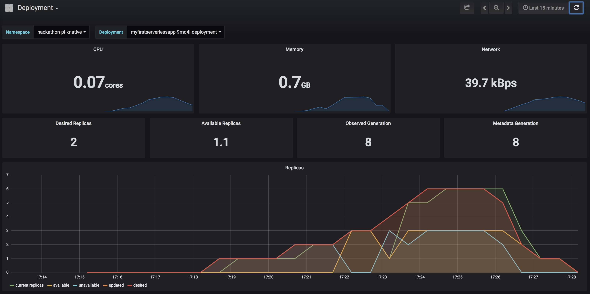

# HACKATHON 2019 - FaaS on Bosun

Hackathon attempt at building a primative autoscaling serverless app served by [kNative](https://knative.dev) on [Bosun](https://github.com/bazaarvoice/bosun)

What I did in advance:
 - Installed Istio and Knative onto a running Bosun cluster following https://istio.io/docs/setup/kubernetes/install/kubernetes/ and https://knative.dev/v0.3-docs/install/

What this project contains:
  - A primative go-lang web app called `myfirstserverlessapp` which includes 3 delegating methods that have tracing enabled (Openjaeger/Zipkin)
  - A multi-stage docker build that creates a primative go-lang web-app container
  - Some Kubernetes files that publish the web-app to a knative-enabled cluster
  - Tooling around calling the loading the web-app in order for it to autoscale (from zero to 10 replicas)

## PRE-REQS

For building and publishing the container_(optional)_:
- `docker` - to create an app image _(optional)_

For deploying | testing | loading:
- `kubectl` - to talk to the Bosun cluster (with admin privileges if a new namespaces is required)
- `jq` - JSON convenience (see https://github.com/stedolan/jq)
- `hey`- Simple web-app loading tool (see https://github.com/rakyll/hey), you'll need a valid go-lang installation to use this tool.

## BUILDING

### Build the app image _(optional)_
This build uses a multi-stage build, where a container is used to build the app before it is copied to a `scratch` container
```
docker build . -t <my-dockerhub-username>/myfirstserverlessapp:v0.1
```
If successful you'll end up with a small docker image containing the web-app
```
REPOSITORY                                          TAG                 IMAGE ID            CREATED             SIZE
<my-dockerhub-username>/myfirstserverlessapp       v0.1               0904135b244d        8 minutes ago       12.6MB
```

### Publish the image to dockerhub _(optional)_
```
docker push <my-dockerhub-username>/myfirstserverlessapp:v0.1
```

## DEPLOYING

### Create an Istio enabled Kubernetes namespace (Admins only!)
```
kubectl create -f hackathon-pi-knative-ns.yml
```
Alternatively label an existing namespace for Istio Injection
```
kubectl label namespace <my-namespace> istio-injection=enabled
```

### Deploy the app using knative
```
kubectl create -f hackathon-pi-knative-svc.yml
```

## TESTING

### Export the hostname running the Istio gateway
```
export KNATIVE_HOST=$(kubectl get svc istio-ingressgateway --namespace istio-system -o json | jq -r .status.loadBalancer.ingress[0].hostname)
```

### Export the knative route domain
This value is passed in the HTTP header and used by Istio to redirect the request to the right app.
```
export KNATIVE_DOMAIN=$(kubectl get route myfirstserverlessapp -o json | jq -r .status.domain)
```

### Make a request to the serverless app (via the Istio gateway)

The app expects 3 parameters:

| Name        | Use           | Expects  |
| ------------- |:-------------:| -----:|
| `in` | get the highest prime found below this number | `int` |
| `nap` | a nap period in seconds | `int` =< 10 |
| `processes` | number of concurrent `go` processes to used to calculate Pi (badly) | `int` |

```
curl -H "Host: ${KNATIVE_DOMAIN}" "http://${KNATIVE_HOST}/?in=10000&nap=3&processes=50"
```

With a bit of luck the FaaS should respond, eg;
```
______                                      _          
| ___ \                                    (_)         
| |_/ / __ _ ______ _  __ _ _ ____   _____  _  ___ ___ 
| ___ \/ _` |_  / _` |/ _` | '__\ \ / / _ \| |/ __/ _ \
| |_/ / (_| |/ / (_| | (_| | |   \ V / (_) | | (_|  __/
\____/ \__,_/___\__,_|\__,_|_|    \_/ \___/|_|\___\___|

Method A calculated the highest prime below 10000 as 9973
Method B napped for 3 seconds
Method C calculated pi as 3.161199 using 50 processes
```

## LOADING

The knative service is configured with a artifical target concurrency of 1 - knative should scale the app (by adding more replicas) if it recieves more than 1 concurrent request.  Approximately 30 seconds after requests stop, knative will scale the app to zero instances.

View the current app replicas:
```
kubectl config set-context $(kubectl config current-context) --namespace=hackathon-pi-knative
kubectl get pods
```

Now load the app for 2 minutes using (knative takes a minute to establish avg concurrency):
```
cd go/src
export GOPATH=$(pwd)
go get -u github.com/rakyll/hey
hey -z 120s -c 11 -host myfirstserverlessapp.hackathon-pi-knative.eu-west-1a.bosun.qa.bazaarvoice.com 'http://a75b17d82762711e99ce20a36548629d-390961240.eu-west-1.elb.amazonaws.com/?in=100000&nap=9&processes=500
```

Knative should autoscale the replicas (up to a max of 10):
```
kubectl get pods
NAME                                                     READY   STATUS    RESTARTS   AGE
myfirstserverlessapp-9mq4l-deployment-7f5cd97f44-5vnxt   0/3     Pending   0          1m
myfirstserverlessapp-9mq4l-deployment-7f5cd97f44-97mn4   3/3     Running   0          1m
myfirstserverlessapp-9mq4l-deployment-7f5cd97f44-hth4c   3/3     Running   0          1m
myfirstserverlessapp-9mq4l-deployment-7f5cd97f44-jnc74   0/3     Pending   0          1m
myfirstserverlessapp-9mq4l-deployment-7f5cd97f44-k6gtn   3/3     Running   0          1m
myfirstserverlessapp-9mq4l-deployment-7f5cd97f44-l6bmm   0/3     Pending   0          1m
myfirstserverlessapp-9mq4l-deployment-7f5cd97f44-pgtd6   0/3     Pending   0          1m
myfirstserverlessapp-9mq4l-deployment-7f5cd97f44-r4586   0/3     Pending   0          1m
myfirstserverlessapp-9mq4l-deployment-7f5cd97f44-rbvkk   0/3     Pending   0          1m
myfirstserverlessapp-9mq4l-deployment-7f5cd97f44-rx2sc   0/3     Pending   0          1m
```

You can also see the scaling in the Grafana graphs:
```
kubectl port-forward --namespace knative-monitoring $(kubectl get pods --namespace knative-monitoring \
--selector=app=grafana --output=jsonpath="{.items..metadata.name}") 3000
```
Then navigate to http://localhost:3000 and look at the `Deployment` dashboard:


Approximately 30 seconds after loading the web-app you will see the replicas scale to zero:
```
kubectl get pods
NAME                                                     READY   STATUS            RESTARTS   AGE
myfirstserverlessapp-9mq4l-deployment-7f5cd97f44-97mn4   3/3     Running           0          3m
myfirstserverlessapp-9mq4l-deployment-7f5cd97f44-hth4c   2/3     Terminating       0          3m
myfirstserverlessapp-9mq4l-deployment-7f5cd97f44-k6gtn   2/3     Terminating       0          3m
myfirstserverlessapp-9mq4l-deployment-7f5cd97f44-rx2sc   2/3     Terminating       0          3m
myfirstserverlessapp-nhlm8-deployment-6f8d75794f-kzr96   0/3     PodInitializing   0          33s
```
